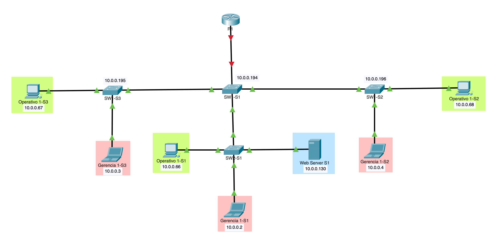
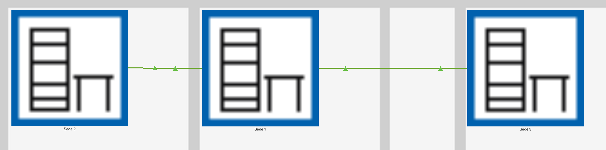

# Repaso redes de telecomunicaciones

## Objetivo

El objetivo de esta práctica es que los estudiantes puedan tener un repaso de lo visto en semestres anteriores referente a routing y switching en un entorno laboral real, para dar paso a la configuración de seguriad en equipos Cisco e iniciar el módulo con otros dispositivos de red.

## Requisitos

- Computador:
  - **Procesador**: Core i3 o superior
  - **RAM**: 8 GB o superior
  - **Disco**: 25 GB o superior

- Software:
  - **Sistema operativo**: Windows (Si bien puede emularse en MacOS y Linux se recomienda windows)
  - **[Packet Tracer](https://www.netacad.com/resources/lab-downloads?courseLang=es-XL)**: Nos permite emular dispositivos cisco (Se debe registrar o ingresar a la plataforma netacad).

- Conexión a internet

## Contexto

1. Suponga una empresa que tiene 3 sedes comunicadas entre sí a través de una red LAN

2. Vamos a generar una red similar a esta:

   

   Físicamente la red se verá asi:

   

3. Identificamos os dispositivos usados, los cuales son:

   - 3 switch modelo 2960-24TT
   - 1 switch modelo PT Empty (con 4 módulos **NM-1CGE** instalados)
   - 1 router modelo 4321
   - 3 PC modelo PT
   - 3 laptop modelo PT
   - 1 servidor modelo PT

4. La configuración de red será la siguiente:

    |Nombre|VLAN|Red|
    |--|--|--|
    |Gerencia|10|10.0.0.0/26|
    |Operativos|20|10.0.0.64/26|
    |Infraestructura|30|10.0.0.128/26|
    |Gestión|40|10.0.0.192/26|

## Procedimiento

### Configuración Router principal sede 1

1. Acceder a modo privilegiado:

   ```bash
   enable
   ```

2. Acceder a modo de configuración:

   ```bash
   conf t
   ```

3. Configurar nombre, en este caso pondremos R1:

   ```bash
   hostname R1
   ```

4. Desactivar la búsqueda de nombres de dominio cuando se introduce un comando incorrecto o una dirección no válida en el dispositivo:

   ```bash
   no ip domain-lookup
   ```

5. Creamos las VLAN y sus segmentos de red asociados:
   1. VLAN de gerencia

      ```bash
      interface gigabitEthernet 0/0/0.10
      encapsulation dot1Q 10
      ip address 10.0.0.1 255.255.255.128
      exit
      ```

   2. VLAN de operativos

      ```bash
      interface gigabitEthernet 0/0/0.20
      encapsulation dot1Q 20
      ip address 10.0.0.65 255.255.255.192
      exit
      ```

   3. VLAN de infraestructura

      ```bash
      interface gigabitEthernet 0/0/0.30
      encapsulation dot1Q 30
      ip address 10.0.0.129 255.255.255.192
      exit
      ```

   4. VLAN de gestión

      ```bash
      interface gigabitEthernet 0/0/0.40
      encapsulation dot1Q 40
      ip address 10.0.0.193 255.255.255.192
      exit
      ```
  
    > Entendiendo que estamos haciendo:
    >
    > `interface gigabitEthernet 0/0/0.10`: Esto crea una subinterfaz llamada GigabitEthernet 0/0/0.10. Cada subinterfaz representa una VLAN específica en un enlace troncal (trunk). El número .10 al final de la interfaz indica que esta subinterfaz estará asociada a la VLAN 10.
    >
    > `encapsulation dot1Q 10`: Este comando activa la encapsulación 802.1Q, que es el protocolo utilizado para transportar tráfico de múltiples VLANs en un enlace troncal. El número 10 indica que esta subinterfaz se asociará con la VLAN 10. Cualquier tráfico que llegue al router etiquetado con el ID de VLAN 10 será procesado por esta subinterfaz.
    >
    > `ip address 10.0.0.1 255.255.255.192`: Aquí asignamos una dirección IP a la subinterfaz. Esta dirección 10.0.0.1 será la puerta de enlace para los dispositivos en la VLAN 10 (Gerencia). La máscara de subred 255.255.255.192 define que la red es de tipo /26 (64 hosts por subred).
    >
    > `exit`: Este comando cierra la configuración de la subinterfaz y vuelve al modo de configuración global.

6. Activamos la interfaz:

   ```bash
   int g0/0/0
   no shutdown
   ```

7. Guardar los cambios:
   De momento no hemos guardado los cambios y si llegaramos a apagar el equipo perderiamos la configuración, por ello se debe escribir en el modo privilegiado el siguiente comando:

   ```bash
   end
   wr
   ```

    > Entendiendo que estamos haciendo:
    >
    > `end`: Este comando te saca del modo de configuración y vuelve al modo privilegiado (enable mode). Es una forma de salir de cualquier modo de configuración de una interfaz o línea, devolviéndote al nivel superior del CLI donde puedes ejecutar comandos globales.
    >
    > `wr`: Es una abreviatura para el comando write memory, que guarda la configuración actual (configuración en ejecución) en la memoria de inicio (startup-config). Esto asegura que los cambios se mantendrán después de un reinicio del router.
