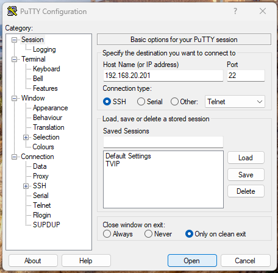

# Instalación servidor LAPP (Linux, Apache, PHP, PostgreSQL)

## Objetivo

El objetivo de esta práctica es que los estudiantes instalen y configuren un entorno de desarrollo completo utilizando el stack **LAPP** (Linux, Apache, PostgreSQL y PHP).

A través de esta actividad, los estudiantes aprenderán a instalar y configurar cada componente del stack, comprendiendo la interacción entre ellos y cómo se integran para crear un entorno de servidor web funcional con soporte para bases de datos PostgreSQL y ejecución de scripts PHP. Al finalizar, los estudiantes tendrán un servidor LAPP operativo que podrán utilizar como base para futuros proyectos y desarrollos web.

## Requisitos

- Computador:
  - **Procesador**: Core i3 o superior
  - **RAM**: 8 GB o superior
  - **Disco**: 25 GB o superior

- Software:
  - **Sistema operativo**: Windows (Si bien puede emularse en MacOS y Linux se recomienda windows)
  - **[Virtualbox](https://www.virtualbox.org/wiki/Downloads)**: Nos permite emular sistemas operativos sin necesidad de instalarlos directamente en el equipo. Se escoge la opción del sistema operativo donde se instalara y se ejecuta el paquete
  - **[Imagen Ubuntu Server](https://releases.ubuntu.com/22.04/)**: Sistema operativo basado en debian, uno de los mas usados en entornos empresariales. Se escoge la última versión estable (para efectos de esta guía se escoge 22.04)
  - **[Putty](https://www.chiark.greenend.org.uk/~sgtatham/putty/latest.html)**: Cliente SSH, nos permitirá conectarnos a la máquina virtual. Se escoge la opción MSI (‘Windows Installer’) y se ejecuta.
  - **[DBeaver](https://dbeaver.io/download/)**: Cliente de base de datos, nos permitirá conectarnos a nuestra base de datos.

  ***Nota: Si tiene otro sistema operativo como MacOS o Linux NO es necesario instalar putty***

- Conexión a internet

## Procedimiento

1. Conectarnos a la máquina virtual, haciendo uso de putty y sabiendo la ip de la máquina como vemos en la siguiente captura, damos click en `Open` o enter

   

2. Ingresamos nuestro usuario y contraseña, si todo esta bien nos mostrara el banner de acceso similar a esto:

   

3. Vamos a actualizar tanto el sistema como los paquetes, con el siguiente comando.

   *Nota: Es posible que nos pida clave por ser la primera instrucción con sudo (usuario administrativo) de ahí en adelante no debería pedir confirmación de la clave*

   ```sh
   sudo apt update && sudo apt upgrade -y
    ```

4. Si nos llega a salir algo similar a esto, solo damos enter sobre `Ok`

   

5. Instalar dependencias.

   Ahora debemos instalar las dependencias que vamos a necesitar, para ello ejecutamos en la consola lo siguiente:

   ```sh
   sudo apt install apache2 postgresql postgresql-contrib php libapache2-mod-php php-pgsql git -y
   ```

   > Entendiendo que estamos haciendo: Estamos instalando varios paquetes:
   >
   > **Apache**: es un servidor web que permite servir contenido web a través del protocolo HTTP. Es uno de los servidores web más utilizados en el mundo debido a su robustez, flexibilidad y soporte para una amplia variedad de lenguajes y módulos.
   >
   > **PostgreSQL**: es un sistema de gestión de bases de datos relacional (RDBMS) de código abierto, conocido por su robustez, escalabilidad y soporte avanzado para consultas SQL complejas. Es una opción popular para almacenar y gestionar datos de manera eficiente.
   > Estamos instalando tanto el servidor como librerias adicionales
   >
   > **PHP**: es un lenguaje de scripting del lado del servidor que se utiliza para desarrollar aplicaciones web dinámicas. Es compatible con una amplia variedad de bases de datos, incluido PostgreSQL, y es esencial para ejecutar aplicaciones web desarrolladas en este lenguaje.
   >
   > **Git**: es un sistema de control de versiones distribuido que facilita el seguimiento de cambios en el código fuente de un proyecto. Es ampliamente utilizado en el desarrollo de software para gestionar el código, colaborar con otros desarrolladores, y mantener un historial de versiones.

   Empezará la instalación de módulos y paquetes (depende la conexión a internet este proceso puede tardar)

   

   *Nota: Si nos aparece alguna ventana para seleccionar entre un usuario por defecto y un usuario 1000, simplemente damos en OK sin seleccionar ninguno*

6. Configuración Apache

   Vamos a habilitar el servicio de apache al inicio (es decir, cada vez que la máquina inicie, levantará el servicio)

   ```shell
   sudo systemctl enable apache2
   ```

   Si todo sale bien nos debe mostrar algo asi:

   

   Para probar que funciona, podemos validar el estado del servicio, con el comando:

   ```shell
   sudo systemctl status apache2
   ```

   Que mostrará algo asi:

   

   Para salir, simplemente con la combinación de teclas ctrl + C

   Ahora en una ventana de nuestro sistema operativo anfitrión (Windows) vamos a abrir la IP de nuestra máquina virtual (en nuestro caso la 192.168.20.201), si todo funciona bien, veremos algo asi:

   

7. Validar instalación de PHP

   Para confirmar que nuestro PHP esta correctamente instalado vamos a crear un archivo nuevo en la carpeta raíz de apache, a través del siguiente comando:

   ```shell
   echo "<?php phpinfo(); ?>" | sudo tee /var/www/html/info.php
   ```

   > Entendiendo que estamos haciendo:
   >
   > `echo "<?php phpinfo(); ?>"`: Este comando echo genera una línea de código PHP que ejecuta la función phpinfo(). Esta función muestra información detallada sobre la configuración de PHP en el servidor, incluyendo variables de entorno, módulos instalados, configuraciones de PHP, y mucho más.
   >
   > `|`: El símbolo de pipe ( | ) se utiliza para redirigir la salida del comando echo al siguiente comando en la línea, en lugar de mostrarlo en la pantalla.
   >
   > `sudo tee /var/www/html/info.php`: El comando tee recibe la salida del echo y la escribe en un archivo llamado info.php dentro del directorio /var/www/html/. sudo se usa para asegurarse de que tienes los permisos necesarios para escribir en ese directorio, que es el directorio raíz de Apache donde se alojan los archivos web por defecto.
   >
   > `/var/www/html/info.php`: Esta es la ruta completa donde se creará el archivo info.php. Al colocar este archivo en el directorio raíz de Apache, será accesible desde un navegador web.

   Para comprobar que esta todo bien, vamos nuevamente a nuestro navegador web del sistema anfitrión (Windows) y en la ip agregamos `/info.php`, donde debe mostrarnos algo asi:

   

8. Probando git

   Vamos a confirmar la correcta instalación de git, para ello ejecutamos

   ```shell
   git --version
   ```

   Nos debe mostrar algo asi:

   

9. Configurando PostgreSQL

   Vamos a habilitar el servicio de base de datos PostgreSQL al inicio (es decir, cada vez que la máquina inicie, levantará el servicio)

   ```shell
   sudo systemctl enable postgresql
   ```

   Si todo sale bien nos debe mostrar algo asi:

   

   Para probar que funciona, podemos validar el estado del servicio, con el comando:

   ```shell
   sudo systemctl status postgresql
   ```

   Que mostrará algo asi:

   

   Para salir, simplemente con la combinación de teclas ctrl + C

   Si queremos verificar la consola de PostgreSQL debemos loguearnos con el usuario postgres (quien tiene permisos de administrador hacia el serviciod de base de datos)

   ```shell
   sudo -i -u postgres
   ```

   Aca cambiará nuestro usuario a postgres y ejecutaremos el comando:

   ```shell
   psql
   ```

   Veremos la consola psql, donde podremos ver las bases de datos con el comando:

   ```shell
   \l
   ```

   El resultado será este:

   

   Para salir usamos el comando `\q` y luego el comando `exit`

   

10. Permitir acceso remoto y crear un usuario de base de datos

      Por defecto no podemos conectarnos desde fuera de nuestra máquina local (localhost), para ello debemos modificar los archivos de configuración.

      Primero debemos saber la versión instalada de nuestro postgreSQL, para ello escribimos:

      ```shell
      psql --version
      ```

      Esto va a mostrar la versión (ej 14.13), este primer numero lo vamos a tomar para ingresarlo en los comandos de configuración:

      ```shell
      sudo nano /etc/postgresql/14/main/postgresql.conf
      ```

      Esto abrirá el editor de texto en consola, para buscar usamos las teclas **ctrl + w** y buscamos en la caja de texto **listen_address**, ahí cambiaremos la palabra **localhost** por *, y borramos el numeral del inicio. Salimos con **ctrl + x**, damos enter dos veces para que guarde la información y la sobreescriba en el mismo archivo.

      

      Ahora vamos a modificar el otro archivo de configuración:

      ```shell
      sudo nano /etc/postgresql/14/main/pg_hba.conf
      ```

      Al final del archivo, agregamos esta línea

      ```shell
      host    all             all             0.0.0.0/0               md5
      ```

      Guardamos los cambios y cerramos el editor.

      Reiniciamos el servicio de postgreSQL:

      ```shell
      sudo service postgresql restart
      ```

      Ahora creamos un usuario administrador (por cuestiones de seguridad el usuario root no tiene acceso de forma remota).

      ```shell
      sudo -i -u postgres psql
      ```

      Dentro de la consola psql creamos un usuario, cambiando la palabra **nombre_usuario** y **password_usuario** por un usuario y clave que recuerde.

      ```sql
      CREATE USER nombre_usuario WITH PASSWORD 'password_usuario';
      ```

      Si fue exitoso debe decir `CREATE ROLE`. Ahora asignamos permisos de administrador.

      ```sql
      ALTER USER nombre_usuario WITH SUPERUSER;
      ```

      Si fue exitoso debe decir `ALTER ROLE`. Salimos con el comando `exit`

11. Probamos la conexión.

      A través de un cliente de base de datos (DBeaver) vamos a conectarnos a nuestro servidor de base de datos, para ello vamos a ingresar a nueva conexión -> PostgreSQL.

      - **Host:** La ip de nuestra máquina virtual.
      - **Database:** La base de datos a la que nos vamos a conectar (por defecto ***postgres***)
      - **Nombre de usuario:** El usuario que creamos de base de datos.
      - **Contraseña:** La contraseña de base de datos.

      Damos en probar conexión y debería salir el mensaje: **Conectado**, damos en aceptar y crearemos una nueva base de datos llamada `practica_ucompensar` y en owner ponemos el usuario que creamos.

12. Desplegar aplicación

      1. Nuestros códigos fuentes tienen un sistema de versionamiento (control de cambios), en nuestro caso vamos a clonar un repositorio que contiene la aplicación a ejecutar.

         ```shell
         git clone https://github.com/jsalonl/ucompensar-php-psql
         ```

      2. Entrar al directorio y copiar variables de entorno

         ```shell
         cd ucompensar-php-psql
         cp .env.example .env
         ```

      3. Editar .env y agregar los datos de conexión a nuestra base de datos, así como en `APP_USER` y `APP_EMAIL` poner nuestro nombre completo y correo electrónico respectivamente. Debe verse algo asi:

         ```shell
         sudo nano .env
         ```

         

      Guardamos y cerramos el editor

      Necesitamos asegurarnos de ejecutar php versión 8.3, para ello vamos a instalarla (el primer comando pide confirmación así que daremos enter):

      ```shell
      sudo add-apt-repository ppa:ondrej/php
      sudo apt update -y && sudo apt upgrade -y
      ```

      Si sale un cuadro indicando alguna interacción solo damos la tecla enter.

      Vamos a instalar un manejador de dependencias llamado composer, útil en entornos de desarrollo basados en PHP:

      ```shell
      sudo apt install composer -y
      ```

      Instalamos extensiones necesarias de php:

      ```shell
      sudo apt install php8.3-xml libapache2-mod-php8.3 -y
      ```

      Ahora vamos a instalar las depedencias necesarias con el comando:

      ```php
      composer install
      ```

      Al final del proceso veremos algo asi:

      

      Ahora vamos a correr las migraciones:

      ```php
      php artisan migrate:fresh --seed
      ```

      Al finalizar nos mostrará esto:

      

      Copiar nuestra aplicación al directorio /www:

      ```shell
      cd
      sudo mv ucompensar-php-psql/ /var/www/html/
      ```

      Creamos un archivo de configuración para el sitio nuevo en apache con el comando:

      ```shell
      sudo nano /etc/apache2/sites-available/ucompensar-php-psql.conf
      ```

      Dentro, ponemos la siguiente información y guardamos

      **Nota:** La ip 192.168.20.201 debe ser cambiada por la ip que tenagmos en la máquina virtual

      ```apache
      <VirtualHost *:80>
         ServerName 192.168.20.201
         DocumentRoot /var/www/html/ucompensar-php-psql/public

         <Directory /var/www/html/ucompensar-php-psql>
            AllowOverride All
            Require all granted
         </Directory>

         ErrorLog ${APACHE_LOG_DIR}/error.log
         CustomLog ${APACHE_LOG_DIR}/access.log combined
      </VirtualHost>
      ```

      Habilitamos el sitio

      ```shell
      sudo a2ensite ucompensar-php-psql.conf
      ```

      Habilitamos el módulo de url amigable

      ```shell
      sudo a2enmod rewrite
      ```

      Habilitamos a2enmod con php 8.3 y deshabilitamos las otras

      ```shell
      sudo a2dismod php8.1
      sudo a2enmod php8.3
      ```

      Reiniciamos

      ```shell
      sudo systemctl restart apache2
      ```

      Ahora ajustamos los permisos:

      ```shell
      sudo chown -R www-data:www-data /var/www/html/ucompensar-php-psql
      sudo chmod -R 755 /var/www/html/ucompensar-php-psql
      sudo chmod -R 775 /var/www/html/ucompensar-php-psql/storage
      sudo chmod -R 775 /var/www/html/ucompensar-php-psql/bootstrap/cache
      ```

      Vamos a crear la key del proyecto.

      ```shell
      cd /var/www/html/ucompensar-php-psql
      sudo sudo php artisan key:generate
      ```

      Si ingresamos a la IP a través de un navegador nos debe mostrar lo siguiente:

      

## Conclusiones

1. **Conecptos básicos de interacción con SO**: El estudiante aprendió a interactura con el sistema operativo Linux, realiando labores como:

   - Crear carpetas.
   - Listar directorios.
   - Ver archivos y modificarlos en la terminal
   - Configuración de red
   - Manejo de servicios
   - Manejo de grupos y permisos
   - Instalación de paquetes
   - Gestión de dependencias.

2. **Instalación Exitosa del Stack LAPP**: A través de esta práctica, hemos logrado instalar y configurar con éxito un entorno LAPP (Linux, Apache, PostgreSQL y PHP) en un servidor Ubuntu. Este entorno es fundamental para el desarrollo de aplicaciones web robustas y escalables.

3. **Configuración de Servicios**: Hemos aprendido a habilitar y verificar la correcta operación de servicios críticos como Apache y PostgreSQL. Esto garantiza que el servidor web y el sistema de gestión de bases de datos estén disponibles y operativos en todo momento.

4. **Integración de Componentes**: La práctica ha demostrado cómo los diferentes componentes del stack LAPP se integran para proporcionar una plataforma completa para el desarrollo web. Apache sirve como el servidor web, PHP maneja la lógica del lado del servidor, y PostgreSQL gestiona la persistencia de datos.

5. **Uso de Git**: También hemos configurado Git, una herramienta esencial para el control de versiones en el desarrollo de software. Esta configuración permitirá a los estudiantes mantener un historial detallado de los cambios en su código y colaborar eficazmente en proyectos futuros.

6. **Manejo Básico de PostgreSQL**: Los estudiantes han tenido la oportunidad de familiarizarse con PostgreSQL, desde la instalación hasta la ejecución de comandos básicos dentro de su consola. Esto les brinda una base sólida para trabajar con bases de datos en proyectos más complejos.

7. **Comprensión de la Configuración y Seguridad del Sistema**: Además de instalar los componentes del stack, hemos configurado el sistema para que inicie los servicios de Apache y PostgreSQL automáticamente al encender la máquina. Esto no solo es conveniente, sino que también mejora la seguridad y la fiabilidad del servidor.
