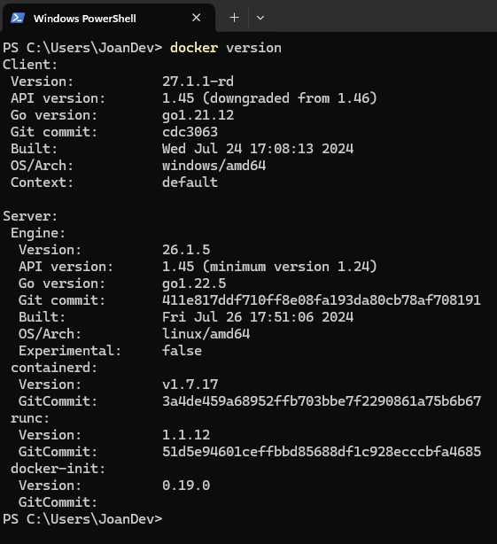
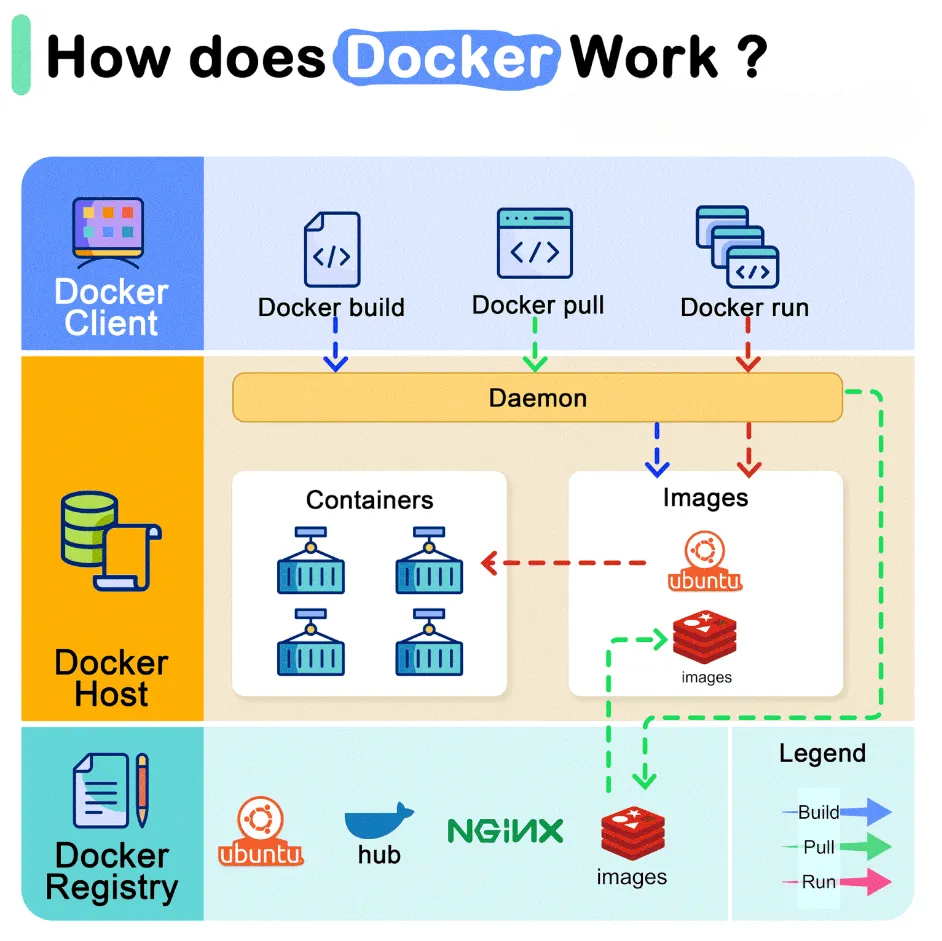
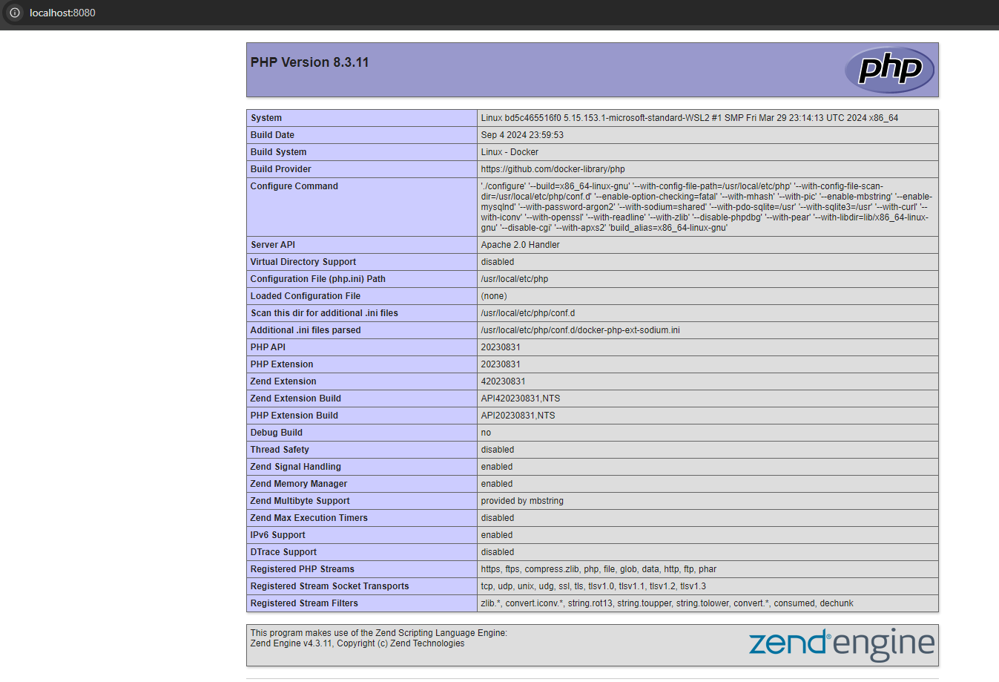

# Introducción a Docker

## Objetivo

El objetivo de esta práctica es que los estudiantes instalen y configuren un entorno de docker.

A través de esta actividad, los estudiantes aprenderán a instalar y configurar cada componente perteneciente al ecosistema Docker, comprendiendo la interacción entre ellos y cómo se integran para crear un entorno funcional.

## Requisitos

- Computador:
  - **Procesador**: Core i3 o superior
  - **RAM**: 8 GB o superior
  - **Disco**: 25 GB o superior

- Software:
  - **Sistema operativo**: Windows (Si bien puede emularse en MacOS y Linux se recomienda windows)
  - **[Rancher Desktop](https://github.com/rancher-sandbox/rancher-desktop/releases/download/v1.15.1/Rancher.Desktop.Setup.1.15.1.msi)**: Herramienta de código abierto que proporciona un entorno de Kubernetes y Docker de forma local.
  - **[Git](https://github.com/git-for-windows/git/releases/download/v2.46.1.windows.1/Git-2.46.1-64-bit.exe)**: Sistema de control de versiones
  - **[DBeaver](https://dbeaver.io/download/)**: Cliente de base de datos, nos permitirá conectarnos a nuestra base de datos.

  ***Nota: Si tiene otro sistema operativo como MacOS o Linux NO es necesario instalar putty***

- Conexión a internet

## Procedimiento

### Instalación y configuración de dependencias

1. Instalación de Rancher Desktop: Una vez descargado solo ejecutamos, aceptamos los términos y damos en instalar.

   Al finalizar la instalación, seleccionamos `Run Rancher Desktop` y damos en `Finish`

2. Configuración de Rancher Desktop: La primera vez que iniciamos nos pedirá Habilitar kubernetes, seleccionar una versión de Kubernetes y seleccionar un motor de Contenedores.

   - **Enable Kubernetes**: Lo seleccionamos para habilitar Kubernetes por defecto.
   - **Kubernetes Version**: Seleccionamos una versión estable (v1.30.4 (stable)).
   - **Container Engine**: dockerd (moby), usaremos este engine para tener todas las funcionalidades asociadas a docker (como la ejecución de docker-compose).

   Damos click en Ok

   Empezará a descargar recursos necesarios (se puede ver el progreso en la parte inferior derecha).

3. Una vez instalado, podemos abrir un terminal de windows y comprobar que docker ya fue instalado:

   ```sh
   docker version
   ```

   Nos dará una salida similar a esta:

   

4. Instalación de git: Una vez descargado el instalador solo procederemos a instalarlo (siguiente en todas las pantallas).

### Entendiendo Docker

1. Vamos a conocer alguons comandos útiles de docker:

   - `docker ps`: Muestra los contenedores activos en el sistema, listando el contenedor ID, imagen, comando, estado, puertos y nombre.
   - `docker images`: Muestra todas las imágenes disponibles localmente en el sistema, listando el repositorio, etiqueta (tag), ID de imagen, fecha de creación y tamaño.
   - `docker run [image]`: Inicia un nuevo contenedor a partir de una imagen especificada. Ejemplo: `docker run nginx` ejecuta un contenedor de Nginx.
   - `docker pull [image]`: Descarga una imagen desde Docker Hub o desde un registro de Docker. Ejemplo: `docker pull ubuntu` descarga la imagen de Ubuntu.
   - `docker exec [container] [command]`: Ejecuta un comando dentro de un contenedor en ejecución. Ejemplo: `docker exec` mycontainer ls /var ejecuta el comando ls /var dentro del contenedor mycontainer.
   - `docker start [container]`: Inicia un contenedor detenido. Ejemplo: `docker start mycontainer`.
   - `docker stop [container] [command]`: Detiene un contenedor en ejecución de forma limpia. Ejemplo: `docker stop mycontainer`.
   - `docker rm [container]`: Elimina un contenedor detenido. Ejemplo: `docker rm mycontainer`.
   - `docker rmi [image]`: Elimina una imagen de Docker. Ejemplo: docker rmi ubuntu elimina la imagen de Ubuntu.
   - `docker build -t [name:tag] [path]`: Construye una imagen desde un Dockerfile. El parámetro -t permite darle un nombre y una etiqueta (tag) a la imagen. Ejemplo: `docker build -t myapp:1.0 .`
   - `docker logs [container]`: Muestra los logs (salida) de un contenedor. Ejemplo: docker logs mycontainer.
   - `docker network ls`: Lista todas las redes de Docker disponibles en el sistema.
   - `docker volume ls`: Lista todos los volúmenes creados en Docker, que son usados para persistir datos entre reinicios de contenedores.
   - `docker inspect [container/image]`: Muestra información detallada sobre un contenedor o imagen, en formato JSON.
   - `docker stats`: Proporciona estadísticas en tiempo real sobre el uso de recursos de cada contenedor en ejecución, como CPU, memoria, red y disco.
   - `docker system prune`: Limpia el sistema eliminando contenedores, imágenes y volúmenes que no se están utilizando.

2. Docker tambien tiene herramientas que facilitan la orquestación de uno o mas contenedores a través de archivos `.yaml`. Esta herramienta es Docker Compose y también tiene sus comandos útiles:

   - `docker compose up`: Levanta todos los servicios definidos en un archivo docker-compose.yml. Ejemplo: `docker compose up` inicia los contenedores, redes y volúmenes definidos en el archivo.
   - `docker compose down`: Detiene y elimina los contenedores, redes, y volúmenes creados por docker compose up.

   > Tambien podemos aplicar flags o banderas a nuestros comandos, para alterar el comportamiento:
   >
   > Por ejemplo: `docker compose up -d` levanta el servicio en segundo plano, así no veremos la salida en la consola.
   > `docker compose down -v` borrará los volumenes asociados a nuestros contenedores (esto genera pérdida de información)

3. Aqui algunas cosas a entender dentro de un archivo Dockerfile:

   - `FROM [imagen_base]`: Especifica la imagen base que se usará para crear la nueva imagen. Esto es el punto de partida. Ejemplo: `FROM php:8.3-apache`
   - `WORKDIR [directorio]`: Establece el directorio de trabajo dentro del contenedor. Todos los comandos que siguen se ejecutarán desde este directorio. Si el directorio no existe, se crea. Ejemplo: `WORKDIR /var/www/html`
   - `COPY [origen] [destino]`: Copia archivos o directorios desde el sistema host al contenedor. Ejemplo: `COPY . /var/www/html`
   - `RUN [comando]`: Ejecuta un comando en la construcción de la imagen. Esto se usa para instalar dependencias, ejecutar scripts, etc. Ejemplo: `RUN apt-get update && apt-get install -y curl`
   - `CMD [comando]`: Define el comando que se ejecutará cuando el contenedor se inicie. A diferencia de RUN, CMD se ejecuta al iniciar el contenedor, no durante la creación de la imagen. Ejemplo: `CMD ["python3", "app.py"]` Esto ejecutará python3 app.py cuando el contenedor se inicie.
   - `EXPOSE [puerto]`: Indica el puerto que la aplicación dentro del contenedor utilizará. No abre el puerto por sí mismo, pero es una declaración de que el contenedor estará escuchando en ese puerto. Ejemplo: `EXPOSE 8080`
   - `ENV [variable] [valor]`: Establece una variable de entorno dentro del contenedor. Ejemplo: `ENV APP_ENV=production`
   - `ENTRYPOINT [comando]`: Similar a CMD, pero no se puede sobrescribir cuando inicias el contenedor. Se usa para definir el comando principal que se ejecutará. Ejemplo: `ENTRYPOINT ["python3", "app.py"]`
   - `ARG [nombre]`: Define un argumento que puede pasarse durante el build de la imagen. Estos argumentos no están disponibles dentro del contenedor en ejecución. Ejemplo:

      ```Dockerfile
      ARG VERSION=1.0
      RUN echo "Building version $VERSION"
      ```

### Práctica 1: Aplicación simple con PHP

Veamos un ejemplo de una aplicación que me muestre la información de PHP, crearemos un archivo llamado `Dockerfile` con el siguiente contenido.

```Dockerfile
# Usamos una imagen oficial de PHP 8.3 con Apache
FROM php:8.3-apache

# Establecemos el directorio de trabajo
WORKDIR /var/www/html

# Creamos un archivo index.php que mostrará la información de PHP
RUN echo "<?php phpinfo(); ?>" > /var/www/html/index.php

# Exponemos el puerto 80 para acceso HTTP
EXPOSE 80

# Ejecutamos Apache en primer plano cuando el contenedor arranque
CMD ["apache2-foreground"]
```

Ahora en la carpeta donde tenemos este archivo vamos a construir la imagen:

```shell
docker build -t php83-info .
```

Este comando descargará los recursos necesarios para armar una imagen y podemos ver como funciona en la siguiente imagen



Una vez termine el proceso de construcción de la imagen podemos correrlo con el siguiente comando:

```shell
docker run -p 8080:80 php83-info
```

> La bandera (flag) -p indica el puerto externo (en nuestra máquina anfitrión) y el puerto interno de nuestro contenedor (el que definimos en el archivo en el apartado EXPOSE), básicamente estamos haciendo una redirección de puertos

Al ejecutarlo veremos una salida en pantalla y si vamos a nuestro navegador a la dirección `http://loaclhost:8080` veremos nuestra aplicación corriendo



### Práctica 2: Aplicación con stack Apache, PHP y PostgreSQL

Cuando trabajamos con aplicaciones que requieren múltiples servicios, como un servidor web con una base de datos, es recomendable usar Docker Compose. Docker Compose es una herramienta que te permite definir y ejecutar aplicaciones Docker que involucren varios contenedores. En lugar de manejar cada contenedor manualmente, Docker Compose simplifica la configuración, interconexión y orquestación de estos contenedores mediante un solo archivo de configuración llamado docker-compose.yaml

1. Clonamos el repositorio:

   ```shell
   git clone https://github.com/jsalonl/ucompensar-php-psql.git
   ```

2. Abrir con Visual Studio Code

3. Una vez abierto abrimos el terminal y escribimos

   ```shell
   docker compose up --build
   ```

4. Si entramos al navegador a `http://localhost:8080` podremos ver nuestra aplicación corriendo